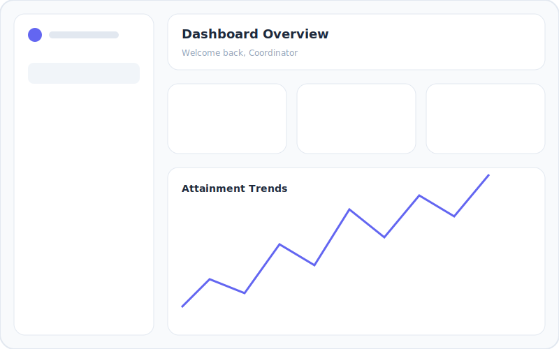

# IQAC Portal


## Overview
**IQAC Portal** is a premium, multi-tenant auditing and feedback platform designed for institutional quality assurance. It simplifies the process of collecting student feedback, calculating NAAC (National Assessment and Accreditation Council) attainment levels, and generating detailed reports for Course Outcomes (CO) and Program Outcomes (PO).

## Key Features
- **Department-wise Isolation**: Specialized logins for department coordinators with strict data scoping.
- **NAAC-compliant Analytics**: Automatic calculation of CO/PO attainment with Level 1-3 classification.
- **Dynamic Dashboards**: Real-time statistics, monthly response trends, and course-wise performance charts.
- **Form Builder**: Easily create CO attainment forms, exit surveys, and curriculum feedback forms.
- **Detailed Student Feedback**: Track individual student responses with roll number associations.
- **PDF Export**: Optimized reporting layout for professional NAAC documentation.

## System Architecture
Built with a modern, high-performance stack:
- **Backend**: PHP 8.x with PDO (MySQL)
- **Frontend**: Tailwind CSS, Vanilla JS, Chart.js
- **UI Design**: Premium Glassmorphism theme with sleek micro-animations.

## Getting Started

### Prerequisites
- XAMPP / WAMP / LAMP (PHP 7.4+ & MySQL)
- Git

### Installation
1. Clone the repository:
   ```bash
   git clone <repository-url>
   ```
2. Place the project in your `htdocs` directory.
3. Configure the database in `config.php`.
4. Run `setup.php` to initialize the database and tables.
5. Create logins by navigating to `admin/migrate_admins.php`.

### Credentials
- **Superadmin**: `iqac` / `iqac`
- **Department Coordinators**: (Username: Dept Code, Password: Dept Code)

## Screenshots


*(Note: These are conceptual designs. Real system screenshots can be captured from the portal.)*

## License
Proprietary / Institutional Use
